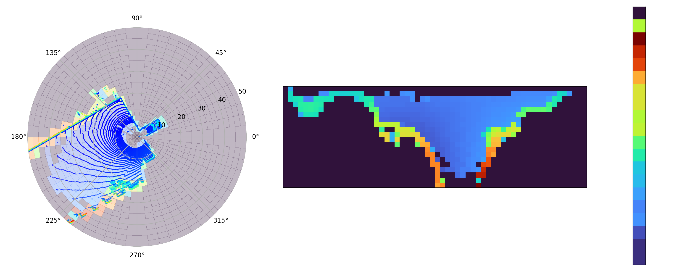
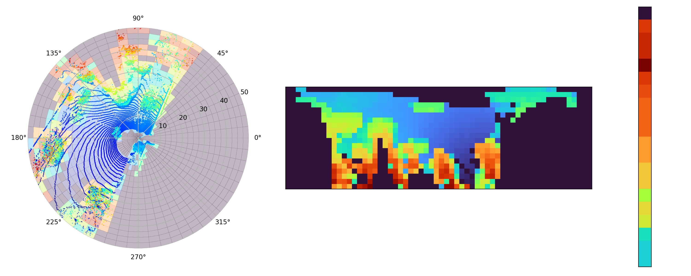
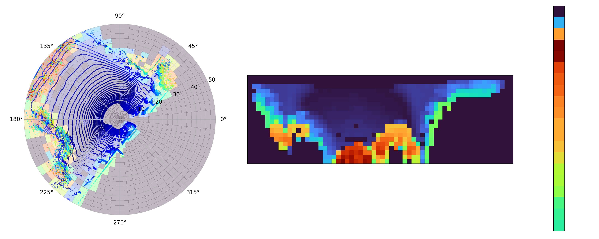

# Scan Context
[](https://opensource.org/licenses/MIT)

This library provides a simple and light weight implementation of the ScanContext descriptor and place recognition database originally presented in [1]. Specifically, this library provides functionality to 1) Compute ScanContext descriptors from LiDAR Scans and 2) maintain and query a database of descriptors for LiDAR place recognition.

[1] G. Kim and A. Kim, "Scan Context: Egocentric Spatial Descriptor for Place Recognition Within 3D Point Cloud Map," 2018 IEEE/RSJ International Conference on Intelligent Robots and Systems (IROS), Madrid, Spain, 2018, pp. 4802-4809,




*1) LiDAR Scans overlaid with descriptor in polar space, 2)ScanContext Descriptor, 3) RingKey*

# Documentation

#### Project Structure
* `scan_context/` - Contains the implementation in `include + src` subdirectories
  * `scan_context` - Provides implementation to compute and store ScanContext descriptors.
  * `database` - Provides implementation of incremental database for LiDAR place recognition with ScanContext.
* `python/` - Contains definitions for python wrappers of the modules above.
* `tests/` - Provides unit tests to validate the implementation.

Code is currently documented with in-line comments (doxygen coming soon!). For example usage please see the unit tests in `tests/`.


#### Pointcloud Definitions
This library defines the input pointcloud very generically to enable developers to use it within existing systems. Specifically, we only assume that PointClouds are `std::vectors` of structures of templated type T. The user can use any T so long as it includes x, y, z elements. The only thing the user has to do is to provide the correct Accessor function to extract this elements from T.

We provide 3 common Accessor functions (`scan_context/include/scan_context/types.h`), and example usage can be found in the unit tests.

Since we expect most people to use ScanContext along side PCL who's point structures are accessed with fields, we set the default accessor to `fieldAccessor`.

#### Dependencies
The following libraries are dependencies of ScanContext:
* Eigen3 [Matrix Math] - Must be installed on the system.
* nanoflann [KDTrees in Database] - Included automatically via fetch content.
* Pybind11 [Python Bindings] - Enables python bindings.
  * Required ONLY if `-DSCAN_CONTEXT_BUILD_PYTHON=TRUE`.
* gtest [Unit Testing Framework] - Provides unit testing framework.
  * Required ONLY if `-DSCAN_CONTEXT_BUILD_TESTS=TRUE`.

#### Installation
##### C++
We do not provide infrastructure to install this library. It is only ever going to be used in the context of another project, so we heavily suggest incorporating it into your CMake based project via `FetchContent`. An example of the CMake code required to do so can be found below and an example of this being used in a larger project is coming soon!

```
include(FetchContent)
FetchContent_Declare(
  scan_context
  GIT_REPOSITORY git@github.com:DanMcGann/scan_context.git
  GIT_TAG        main
)
FetchContent_MakeAvailable(scan_context)
```

##### Python
Unfortunately, python does not provide the same level of convenience to include in existing projects. To install the python bindings...
* Clone this repository
  * `git clone git@github.com:DanMcGann/scan_context.git`
* Build the code
  * `cd scan_context && mkdir build && cd build`
  * `cmake .. -DSCAN_CONTEXT_BUILD_PYTHON=TRUE`
  * `make`
* Install the Python Bindings
  * `make python-install`

Note: The CMake target `python-install` uses `pip` under the hood, this means that you can specifically install `scan_context` within conda or similar environments.


#### Testing
To run the unit tests:
* Clone this repository
  * `git clone git@github.com:DanMcGann/scan_context.git`
* Build the code
  * `cd scan_context && mkdir build && cd build`
  * `cmake .. -DSCAN_CONTEXT_BUILD_PYTHON=TRUE`
  * `make`
* Run the Unit tests
  * `make test`

# Issues
If you have any issues with this library please submit a github ticket. If you are reporting a bug please provide a unit test that demonstrates the bug!
